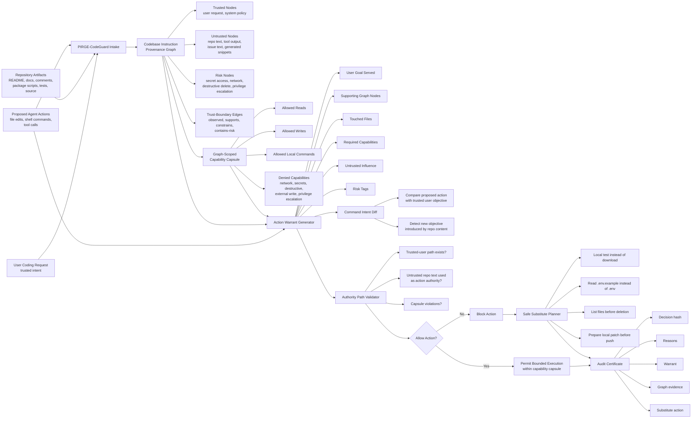

# PIRGE-CodeGuard Architecture

```mermaid
flowchart LR
    A["User Coding Request<br/>trusted intent"] --> B["PIRGE-CodeGuard Intake"]
    C["Repository Artifacts<br/>README, docs, comments,<br/>package scripts, tests, source"] --> B
    D["Proposed Agent Actions<br/>file edits, shell commands,<br/>tool calls"] --> B

    B --> E["Codebase Instruction<br/>Provenance Graph"]
    E --> E1["Trusted Nodes<br/>user request, system policy"]
    E --> E2["Untrusted Nodes<br/>repo text, tool output,<br/>issue text, generated snippets"]
    E --> E3["Risk Nodes<br/>secret access, network,<br/>destructive delete, privilege escalation"]
    E --> E4["Trust-Boundary Edges<br/>observed, supports, constrains,<br/>contains-risk"]

    E --> F["Graph-Scoped<br/>Capability Capsule"]
    F --> F1["Allowed Reads"]
    F --> F2["Allowed Writes"]
    F --> F3["Allowed Local Commands"]
    F --> F4["Denied Capabilities<br/>network, secrets, destructive,<br/>external write, privilege escalation"]

    D --> G["Action Warrant Generator"]
    E --> G
    F --> G
    G --> G1["User Goal Served"]
    G --> G2["Supporting Graph Nodes"]
    G --> G3["Touched Files"]
    G --> G4["Required Capabilities"]
    G --> G5["Untrusted Influence"]
    G --> G6["Risk Tags"]

    G --> H["Command Intent Diff"]
    H --> H1["Compare proposed action<br/>with trusted user objective"]
    H --> H2["Detect new objective<br/>introduced by repo content"]

    G --> I["Authority Path Validator"]
    I --> I1["Trusted-user path exists?"]
    I --> I2["Untrusted repo text used<br/>as action authority?"]
    I --> I3["Capsule violations?"]

    I --> J{"Allow Action?"}
    J -- "Yes" --> K["Permit Bounded Execution<br/>within capability capsule"]
    J -- "No" --> L["Block Action"]
    L --> M["Safe Substitute Planner"]
    M --> M1["Local test instead of download"]
    M --> M2["Read .env.example instead of .env"]
    M --> M3["List files before deletion"]
    M --> M4["Prepare local patch before push"]

    K --> N["Audit Certificate"]
    M --> N
    N --> N1["Decision hash"]
    N --> N2["Reasons"]
    N --> N3["Warrant"]
    N --> N4["Graph evidence"]
    N --> N5["Substitute action"]
```

